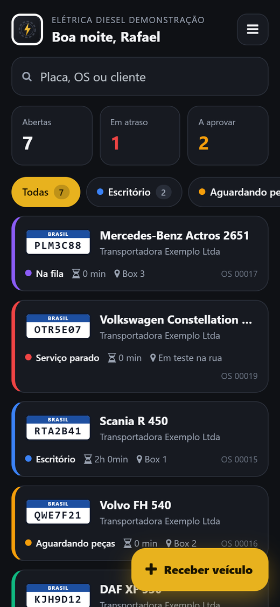
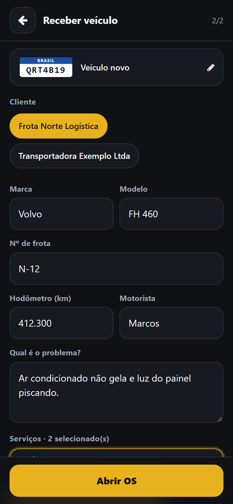
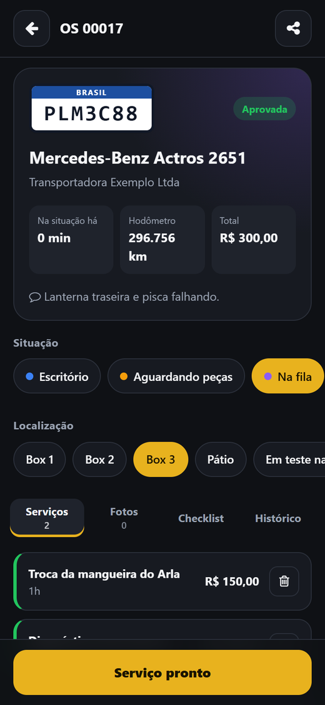
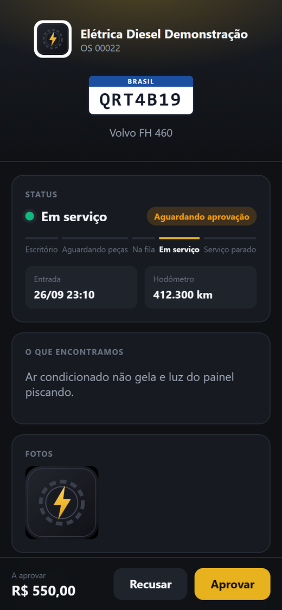
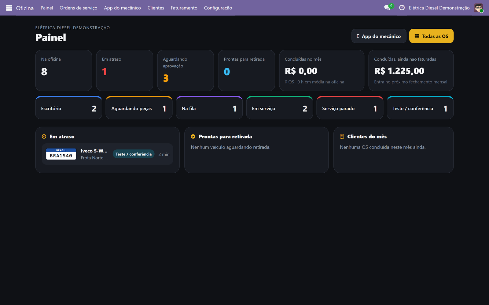
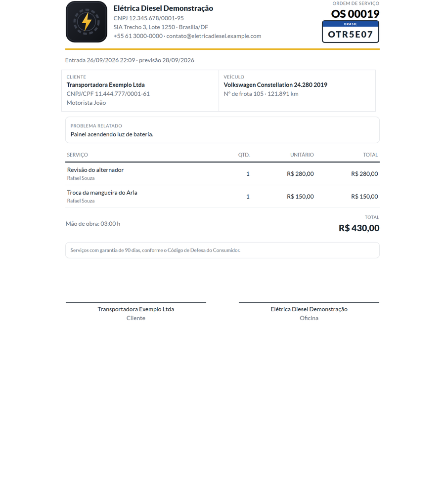
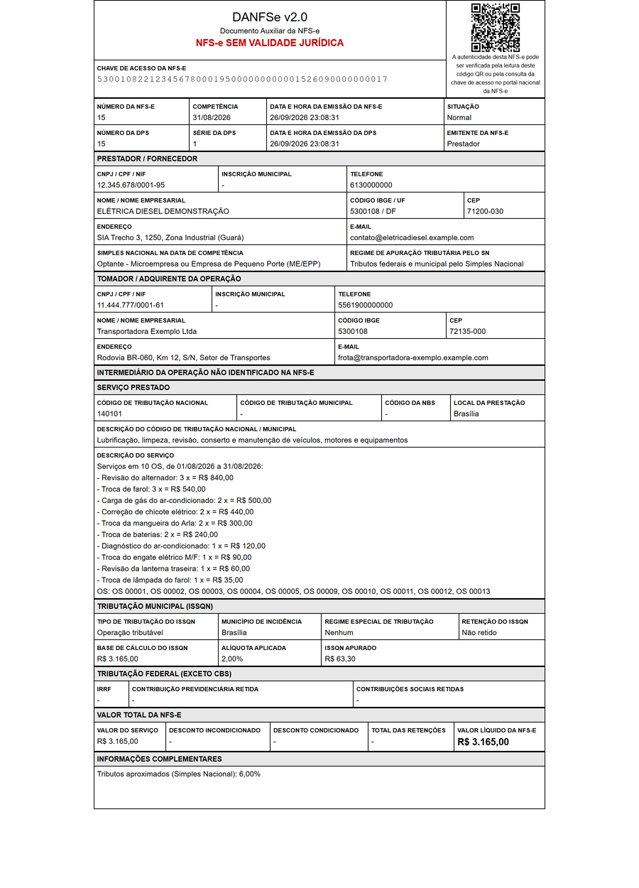
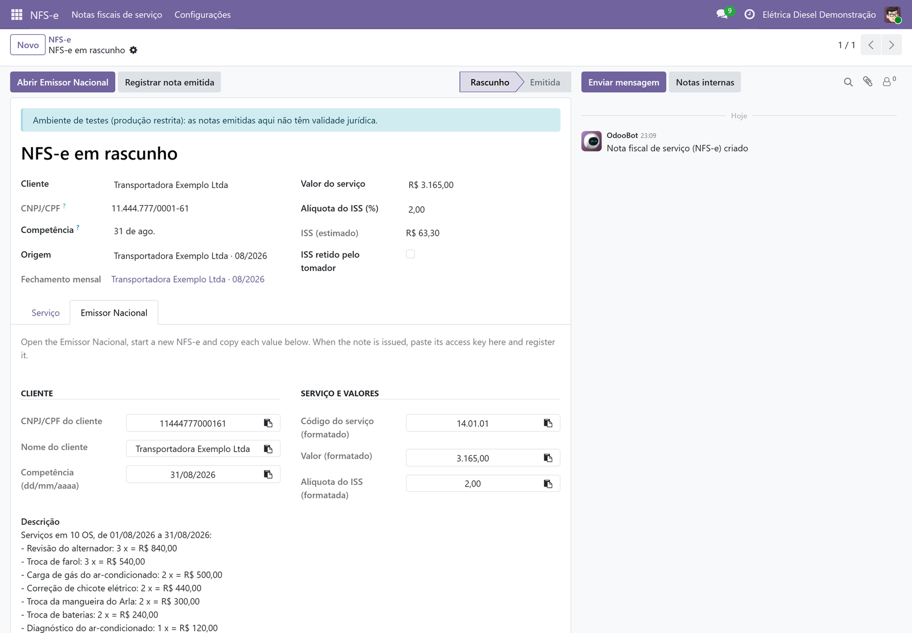

# Oficina OS

[](README.md)
[](README.pt-BR.md)

Ordens de serviço para oficinas de elétrica e ar-condicionado de caminhões, feito em **Odoo 19 Community**.
O mecânico toca o serviço pelo celular, o cliente da frota aprova o orçamento por um link no WhatsApp e o
escritório faz o fechamento do mês e emite a **NFS-e** pelo Sistema Nacional.

Marca própria para cada oficina: logos, cores e ícone do app no celular. A interface é em português.

<p>
  
  
  
  
</p>



## O que tem dentro

| Módulo | O que faz |
|---|---|
| [`workshop_os`](workshop_os) | Veículos pela placa (Mercosul e modelo antigo), ordens de serviço, situações com o tempo gasto em cada uma, localizações, checklists, fotos, o app do mecânico (OWL, instalável como PWA), a página de aprovação do cliente com assinatura, o painel do escritório, o fechamento mensal por frota e os PDFs. |
| [`l10n_br_nfse_nacional`](l10n_br_nfse_nacional) | NFS-e pelo Sistema Nacional NFS-e. O modo **assistido** prepara cada campo para o site do Emissor Nacional. O modo **direto** assina a DPS com o certificado A1 da empresa e envia para a SEFIN Nacional. Também: cancelamento e PDF do DANFSe. Funciona sem o módulo da oficina. |
| [`workshop_os_nfse`](workshop_os_nfse) | Módulo de ligação, instalado automaticamente: emite a nota de um fechamento mensal ou de uma OS concluída. |

### O celular do mecânico

- **Receber o caminhão pela placa.** Um veículo já cadastrado traz o cliente e o hodômetro, e uma OS aberta é retomada em vez de duplicada. Um veículo novo é cadastrado no mesmo formulário.
- **Tocar a OS.** Trocar a situação e o box com um toque. Adicionar serviços pelos favoritos ou pela busca. Tirar fotos, que são comprimidas no próprio celular e guardadas no banco ou no Cloudinary. Responder o checklist de entrada, marcar o serviço como pronto e mandar o link de aprovação pelo WhatsApp.
- **Nada se perde no meio.** O rascunho fica guardado no navegador: se entrar uma ligação, a OS pela metade continua lá.

### O cliente

O link de aprovação é `/os/<token>` e não pede login. O gestor da frota vê:

- a situação e a linha do tempo da OS;
- o que foi encontrado e as fotos que a oficina escolheu mostrar;
- os serviços, cada um com a sua caixa de seleção.

Ele aprova o orçamento inteiro ou só uma parte, e assina com o dedo. A aprovação aparece na hora no escritório. Frotas com contrato já entram aprovadas.

### O escritório

- **Painel:** OS atrasadas, aguardando aprovação, caminhões prontos para retirada, o que já foi feito e ainda não faturado, e o faturamento do mês por cliente.
- **Visões:** kanban, calendário e tabela dinâmica, além de uma análise por serviço.
- **Fechamento mensal:** cada frota recebe um relatório agrupado por serviço, com a lista de OS, e depois a NFS-e com um clique.

<p>
  
  
</p>

## NFS-e Nacional: o que importa

O modo direto segue o leiaute nacional 1.01 e as suas regras de rejeição (códigos como E0121 são do Anexo I):

- **DPS montada pelas regras.**
  - O bloco do prestador vai enxuto: sem nome e sem endereço, que o cadastro nacional preenche (E0121, E0128).
  - A alíquota do ISS só vai quando uma ME/EPP tem o ISS retido (E0625/E0621).
  - A estimativa de tributos da Lei 12.741 depende do regime: `pTotTribSN` para ME/EPP, nunca `indTotTrib` (E0712).
  - O texto é limpo para a faixa Latin-1 que o esquema aceita (E1235).
- **Conferida antes de sair.** Toda DPS e todo evento de cancelamento são validados pelos XSDs oficiais, que vêm junto com o módulo. Os problemas aparecem como mensagens legíveis, em vez de um E1235 vindo de fora.
- **Assinatura e envio.**
  - XMLDSig envelopada, como pede o manual nacional: C14N inclusiva, RSA-SHA1, só o certificado final.
  - A assinatura usa o certificado guardado pelo módulo `certificate` do Odoo. O envio é por TLS mútuo, com GZip+Base64.
  - As respostas são lidas sem diferenciar maiúsculas de minúsculas, porque a API já respondeu tanto em camelCase quanto em PascalCase.
- **Sem notas em dobro.** Se uma resposta se perde e o reenvio volta com E0014, o módulo busca a nota que já existe.
- **DANFSe conforme a NT 008.**
  - A API de PDF do ADN foi desligada em 03/08/2026, então o próprio módulo gera o DANFSe.
  - Ele imprime só o que está no XML autorizado, traz o QR code da consulta pública e marca as notas de teste e as canceladas.

Sem certificado, o modo assistido já poupa a digitação: mostra cada valor pronto para copiar e depois registra a chave de acesso da nota emitida.



## Rodar na sua máquina

```bash
docker compose up -d db
docker compose run --rm odoo odoo -d oficina -i workshop_os,workshop_os_nfse --with-demo --load-language=pt_BR --stop-after-init
docker compose up -d odoo
```

Abra http://localhost:8070. Os logins da demonstração são `admin` / `admin` para o escritório e `mecanico` / `mecanico` para o mecânico, que já cai direto no app. Para ver o app do celular, use o modo de celular do navegador ou abra num celular na mesma rede.

Rodar os testes:

```bash
docker compose run --rm odoo odoo -d test -i workshop_os,workshop_os_nfse --test-tags /workshop_os,/l10n_br_nfse_nacional,/workshop_os_nfse --stop-after-init
```

Os 39 testes cobrem:

- **Oficina:** regras de placa, aprovação, página do cliente, fechamento, relatórios, compilação dos estilos e os padrões brasileiros num banco novo.
- **NFS-e:** a DPS contra o XSD oficial, as regras de cada regime, verificação da assinatura e adulteração, sucesso, rejeição e recuperação de E0014 com a API simulada, cancelamento, DANFSe e busca pelo CEP.

## Publicar (Render + Supabase)

O [`Dockerfile`](Dockerfile) coloca os módulos na imagem oficial do Odoo 19. O [`deploy/entrypoint.sh`](deploy/entrypoint.sh) configura o Odoo pelas variáveis de ambiente:

- **Primeira subida:** cria o banco, guarda todos os anexos no PostgreSQL (o disco do contêiner é descartado a cada deploy), instala os módulos em português e define o login e a senha do administrador.
- **Deploys seguintes:** atualiza os módulos só quando o código deles mudou.

| Variável | Valor |
|---|---|
| `DB_HOST`, `DB_PORT`, `DB_USER` | **Session pooler** do Supabase (IPv4; aceita `LISTEN`, que o cron do Odoo usa). O usuário é `postgres.<project-ref>`. |
| `DB_PASSWORD` | senha do banco |
| `DB_NAME` | `odoo` (criado na primeira subida) |
| `ODOO_ADMIN_EMAIL`, `ODOO_ADMIN_PASSWORD` | administrador criado na primeira subida |
| `LOAD_DEMO` | `false` para uma oficina de verdade |

Coloque o banco e o serviço web na **mesma região**, por exemplo Supabase East US (North Virginia) e Render Virginia. O Odoo faz muitas consultas por requisição, e uma ligação entre continentes deixaria todas as páginas lentas.

No plano gratuito, o Odoo usa cerca de 230 MB dos 512 MB. O [`keepalive.yml`](.github/workflows/keepalive.yml) acorda o serviço no horário da oficina quando a variável `KEEPALIVE_URL` está definida no repositório.

## Licença

Odoo Proprietary License v1.0 (OPL-1). Veja [LICENSE](LICENSE) e [COPYRIGHT](COPYRIGHT).

O código é público para leitura e avaliação: qualquer pessoa pode rodá-lo no próprio computador para conhecer o
sistema. Usar de verdade, em produção ou como serviço para terceiros, exige uma licença combinada por escrito com o
autor.
